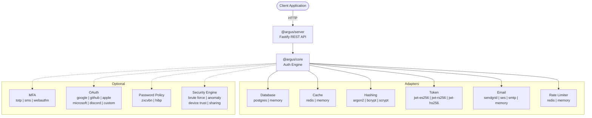

# ArgusJS

A modular, pluggable authentication and authorization server for Node.js applications.

## Features

### Authentication
- Email/password registration and login with secure session management
- JWT access tokens with configurable algorithms (HS256, RS256, ES256)
- Refresh token rotation with automatic reuse detection
- Email verification with token-based flow
- Password reset via email with time-limited tokens
- Password change with history enforcement

### Multi-Factor Authentication
- TOTP (Time-based One-Time Password) support with QR code generation
- SMS-based OTP via Twilio
- WebAuthn/FIDO2 passkey support
- Backup codes for account recovery

### OAuth / Social Login
- Google, GitHub, Apple, Microsoft, Discord providers
- Custom OAuth provider support for any OIDC-compatible IdP
- Automatic account linking by verified email

### Security
- Brute force protection with progressive lockout
- Login anomaly detection (new device, new location, impossible travel)
- Device trust and fingerprinting
- Credential sharing detection
- Rate limiting (in-memory or Redis-backed)
- Password strength validation via zxcvbn and HIBP breach database

### Enterprise
- Multi-tenant organizations with member roles
- Role-based access control (RBAC) with hierarchical permissions
- API key management with scoped permissions
- Webhook system for event notifications
- Full audit logging
- Admin API with user management and impersonation
- GDPR-compliant data export and account deletion

### Pluggable Architecture
- Swap any adapter without changing application code
- Database: PostgreSQL (Drizzle ORM) or in-memory
- Cache: Redis or in-memory
- Email: SendGrid, AWS SES, SMTP, or in-memory
- Hashing: Argon2, bcrypt, or scrypt
- Tokens: JWT with HS256, RS256, or ES256
- Rate limiting: Redis or in-memory

## Quick Start

```ts
import { Argus } from '@argus/core';
import { createApp } from '@argus/server';
import { PostgresAdapter } from '@argus/db-postgres';
import { RedisCache } from '@argus/cache-redis';
import { Argon2Hasher } from '@argus/hash-argon2';
import { JwtES256Provider } from '@argus/token-jwt-es256';

const argus = new Argus({
  db: new PostgresAdapter({ connectionString: process.env.DATABASE_URL! }),
  cache: new RedisCache({ url: process.env.REDIS_URL! }),
  hasher: new Argon2Hasher(),
  token: new JwtES256Provider({ issuer: 'auth.example.com', audience: ['api.example.com'] }),
});

const app = await createApp({ argus });
await app.listen({ port: 3100, host: '0.0.0.0' });
```

## Installation

Install the core package and the adapters you need:

```bash
# Core + Server
pnpm add @argus/core @argus/server

# Database (pick one)
pnpm add @argus/db-postgres    # PostgreSQL with Drizzle ORM
pnpm add @argus/db-memory      # In-memory (development/testing)

# Cache (pick one)
pnpm add @argus/cache-redis    # Redis
pnpm add @argus/cache-memory   # In-memory (development/testing)

# Password hashing (pick one)
pnpm add @argus/hash-argon2    # Argon2 (recommended)
pnpm add @argus/hash-bcrypt    # bcrypt
pnpm add @argus/hash-scrypt    # scrypt (Node.js built-in)

# JWT signing (pick one)
pnpm add @argus/token-jwt-es256  # ES256 asymmetric (recommended)
pnpm add @argus/token-jwt-rs256  # RS256 asymmetric
pnpm add @argus/token-jwt-hs256  # HS256 symmetric

# Email (pick one)
pnpm add @argus/email-sendgrid  # SendGrid
pnpm add @argus/email-ses       # AWS SES
pnpm add @argus/email-smtp      # SMTP
pnpm add @argus/email-memory    # In-memory (development/testing)

# Rate limiting (pick one)
pnpm add @argus/ratelimit-redis   # Redis
pnpm add @argus/ratelimit-memory  # In-memory

# MFA (optional, pick any)
pnpm add @argus/mfa-totp       # TOTP (Google Authenticator, Authy, etc.)
pnpm add @argus/mfa-sms        # SMS via Twilio
pnpm add @argus/mfa-webauthn   # WebAuthn/FIDO2 passkeys

# OAuth providers (optional, pick any)
pnpm add @argus/oauth-google
pnpm add @argus/oauth-github
pnpm add @argus/oauth-apple
pnpm add @argus/oauth-microsoft
pnpm add @argus/oauth-discord
pnpm add @argus/oauth-custom    # Any OIDC-compatible provider

# Password policy (optional, pick any)
pnpm add @argus/policy-zxcvbn   # Strength estimation
pnpm add @argus/policy-hibp     # Breach database check

# Security engine (optional)
pnpm add @argus/security-engine
```

## Full Configuration

```ts
import { Argus } from '@argus/core';
import { createApp } from '@argus/server';
import { PostgresAdapter } from '@argus/db-postgres';
import { RedisCache } from '@argus/cache-redis';
import { Argon2Hasher } from '@argus/hash-argon2';
import { JwtES256Provider } from '@argus/token-jwt-es256';
import { SendGridEmail } from '@argus/email-sendgrid';
import { RedisRateLimiter } from '@argus/ratelimit-redis';
import { TOTPProvider } from '@argus/mfa-totp';
import { GoogleOAuth } from '@argus/oauth-google';
import { GitHubOAuth } from '@argus/oauth-github';
import { ZxcvbnPolicy } from '@argus/policy-zxcvbn';
import { HIBPPolicy } from '@argus/policy-hibp';
import { SecurityEngine } from '@argus/security-engine';

const argus = new Argus({
  // Required adapters
  db: new PostgresAdapter({ connectionString: process.env.DATABASE_URL! }),
  cache: new RedisCache({ url: process.env.REDIS_URL! }),
  hasher: new Argon2Hasher(),
  token: new JwtES256Provider({
    issuer: 'auth.example.com',
    audience: ['api.example.com'],
  }),

  // Email
  email: new SendGridEmail({ apiKey: process.env.SENDGRID_API_KEY! }),

  // Rate limiting
  rateLimiter: new RedisRateLimiter({ url: process.env.REDIS_URL! }),

  // MFA providers
  mfa: {
    totp: new TOTPProvider({ issuer: 'MyApp' }),
  },

  // OAuth providers
  oauth: {
    google: new GoogleOAuth({
      clientId: process.env.GOOGLE_CLIENT_ID!,
      clientSecret: process.env.GOOGLE_CLIENT_SECRET!,
      redirectUri: 'https://example.com/auth/callback/google',
    }),
    github: new GitHubOAuth({
      clientId: process.env.GITHUB_CLIENT_ID!,
      clientSecret: process.env.GITHUB_CLIENT_SECRET!,
      redirectUri: 'https://example.com/auth/callback/github',
    }),
  },

  // Password policies
  passwordPolicy: [
    new ZxcvbnPolicy({ minScore: 3 }),
    new HIBPPolicy(),
  ],

  // Security engine
  security: new SecurityEngine(),

  // Configuration
  password: { minLength: 10, maxLength: 128, historyCount: 5 },
  session: { maxAge: '7d', maxPerUser: 5 },
  accessToken: { expiresIn: '15m' },
  refreshToken: { expiresIn: '30d', rotationEnabled: true },
  mfaEncryptionKey: process.env.MFA_ENCRYPTION_KEY!,
  audit: { enabled: true },
});

const app = await createApp({
  argus,
  cors: { origin: ['https://example.com'] },
  logger: true,
});

await app.listen({ port: 3100, host: '0.0.0.0' });
```

## Packages

| Package | Description |
|---|---|
| `@argus/core` | Core authentication engine, types, interfaces, and utilities |
| `@argus/server` | Fastify HTTP server with REST API routes |
| `@argus/db-postgres` | PostgreSQL database adapter using Drizzle ORM |
| `@argus/db-memory` | In-memory database adapter for development and testing |
| `@argus/cache-redis` | Redis cache adapter using ioredis |
| `@argus/cache-memory` | In-memory cache adapter for development and testing |
| `@argus/hash-argon2` | Argon2id password hashing adapter |
| `@argus/hash-bcrypt` | bcrypt password hashing adapter |
| `@argus/hash-scrypt` | Node.js built-in scrypt password hashing adapter |
| `@argus/token-jwt-es256` | JWT token provider using ES256 (ECDSA) signing |
| `@argus/token-jwt-rs256` | JWT token provider using RS256 (RSA) signing |
| `@argus/token-jwt-hs256` | JWT token provider using HS256 (HMAC) signing |
| `@argus/email-sendgrid` | Email delivery via SendGrid API |
| `@argus/email-ses` | Email delivery via AWS SES |
| `@argus/email-smtp` | Email delivery via SMTP using Nodemailer |
| `@argus/email-memory` | In-memory email adapter for development and testing |
| `@argus/ratelimit-redis` | Redis-backed rate limiter using sliding window |
| `@argus/ratelimit-memory` | In-memory rate limiter for development and testing |
| `@argus/mfa-totp` | TOTP multi-factor authentication using otplib |
| `@argus/mfa-sms` | SMS-based MFA via Twilio |
| `@argus/mfa-webauthn` | WebAuthn/FIDO2 passkey MFA using SimpleWebAuthn |
| `@argus/oauth-google` | Google OAuth 2.0 provider |
| `@argus/oauth-github` | GitHub OAuth 2.0 provider |
| `@argus/oauth-apple` | Apple Sign In provider |
| `@argus/oauth-microsoft` | Microsoft/Azure AD OAuth provider |
| `@argus/oauth-discord` | Discord OAuth 2.0 provider |
| `@argus/oauth-custom` | Custom OAuth/OIDC provider adapter |
| `@argus/policy-zxcvbn` | Password strength estimation via zxcvbn |
| `@argus/policy-hibp` | Password breach check via Have I Been Pwned API |
| `@argus/security-engine` | Brute force protection, anomaly detection, device trust |

## Architecture



## API Endpoints

All endpoints are prefixed with `/v1` unless otherwise noted.

### Health

| Method | Path | Auth | Description |
|---|---|---|---|
| `GET` | `/v1/health` | No | Basic health check |
| `GET` | `/v1/health/live` | No | Liveness probe |
| `GET` | `/v1/health/ready` | No | Readiness probe (checks DB and cache) |

### Authentication

| Method | Path | Auth | Description |
|---|---|---|---|
| `POST` | `/v1/auth/register` | No | Register a new user |
| `POST` | `/v1/auth/login` | No | Log in with email and password |
| `POST` | `/v1/auth/refresh` | No | Refresh an access token |
| `POST` | `/v1/auth/logout` | Yes | Log out (optionally from all devices) |

### Email Verification

| Method | Path | Auth | Description |
|---|---|---|---|
| `POST` | `/v1/auth/verify-email` | No | Verify email with token |
| `POST` | `/v1/auth/resend-verification` | Yes | Resend verification email |

### Password Management

| Method | Path | Auth | Description |
|---|---|---|---|
| `POST` | `/v1/auth/forgot-password` | No | Request password reset email |
| `POST` | `/v1/auth/reset-password` | No | Reset password with token |
| `POST` | `/v1/auth/change-password` | Yes | Change password (requires current password) |

### Multi-Factor Authentication

| Method | Path | Auth | Description |
|---|---|---|---|
| `POST` | `/v1/auth/mfa/setup` | Yes | Begin MFA setup for a method |
| `POST` | `/v1/auth/mfa/verify-setup` | Yes | Confirm MFA setup with verification code |
| `POST` | `/v1/auth/mfa/verify` | No | Complete MFA challenge during login |
| `POST` | `/v1/auth/mfa/disable` | Yes | Disable MFA |
| `GET` | `/v1/auth/mfa/backup-codes` | Yes | Regenerate backup codes |

### User Profile

| Method | Path | Auth | Description |
|---|---|---|---|
| `GET` | `/v1/auth/me` | Yes | Get current user profile |
| `PATCH` | `/v1/auth/me` | Yes | Update display name or avatar |
| `DELETE` | `/v1/auth/me` | Yes | Soft-delete own account |
| `GET` | `/v1/auth/me/export` | Yes | Export all user data (GDPR) |

### Sessions and Devices

| Method | Path | Auth | Description |
|---|---|---|---|
| `GET` | `/v1/auth/sessions` | Yes | List active sessions |
| `DELETE` | `/v1/auth/sessions/:id` | Yes | Revoke a specific session |
| `GET` | `/v1/auth/devices` | Yes | List trusted devices |
| `POST` | `/v1/auth/devices/:id/trust` | Yes | Mark a device as trusted |
| `DELETE` | `/v1/auth/devices/:id` | Yes | Remove a trusted device |

### JWKS

| Method | Path | Auth | Description |
|---|---|---|---|
| `GET` | `/.well-known/jwks.json` | No | JSON Web Key Set for token verification |

### Admin

All admin endpoints require authentication and the `admin` role.

| Method | Path | Description |
|---|---|---|
| `GET` | `/v1/admin/users` | List users with search/filter/pagination |
| `GET` | `/v1/admin/users/:id` | Get user by ID |
| `PATCH` | `/v1/admin/users/:id` | Update user fields |
| `DELETE` | `/v1/admin/users/:id` | Soft-delete a user |
| `POST` | `/v1/admin/users/:id/unlock` | Unlock a locked account |
| `POST` | `/v1/admin/users/:id/reset-mfa` | Reset MFA for a user |
| `POST` | `/v1/admin/users/:id/reset-password` | Trigger password reset email |
| `POST` | `/v1/admin/impersonate` | Get an impersonation token |
| `GET` | `/v1/admin/audit-log` | Query audit log entries |
| `GET` | `/v1/admin/stats` | Get system statistics |
| `GET` | `/v1/admin/sessions` | List all active sessions |
| `GET` | `/v1/admin/roles` | List roles |
| `POST` | `/v1/admin/roles` | Create a role |
| `PATCH` | `/v1/admin/roles/:name` | Update a role |
| `DELETE` | `/v1/admin/roles/:name` | Delete a role |

## Plugin Development

Every adapter implements a TypeScript interface from `@argus/core`. To create your own adapter, implement the corresponding interface and pass it to the `Argus` constructor.

### Example: Custom Database Adapter

```ts
import type { DbAdapter } from '@argus/core';

export class MyCustomDbAdapter implements DbAdapter {
  async findUserByEmail(email: string) {
    // Your implementation
  }

  async findUserById(id: string) {
    // Your implementation
  }

  async createUser(user: any) {
    // Your implementation
  }

  // ... implement all DbAdapter methods
}
```

### Example: Custom Password Hasher

```ts
import type { PasswordHasher } from '@argus/core';

export class MyHasher implements PasswordHasher {
  async hash(password: string): Promise<string> {
    // Your hashing logic
  }

  async verify(password: string, hash: string): Promise<boolean> {
    // Your verification logic
  }
}
```

### Available Interfaces

| Interface | File | Purpose |
|---|---|---|
| `DbAdapter` | `@argus/core` | Database operations (users, sessions, tokens, orgs) |
| `CacheAdapter` | `@argus/core` | Key-value cache for rate limits, tokens, etc. |
| `PasswordHasher` | `@argus/core` | Password hashing and verification |
| `TokenProvider` | `@argus/core` | JWT signing, verification, and JWKS |
| `EmailProvider` | `@argus/core` | Transactional email delivery |
| `RateLimiter` | `@argus/core` | Request rate limiting |
| `MFAProvider` | `@argus/core` | Multi-factor authentication methods |
| `OAuthProviderAdapter` | `@argus/core` | OAuth/OIDC social login providers |
| `PasswordPolicy` | `@argus/core` | Password strength validation rules |
| `SecurityEngine` | `@argus/core` | Brute force, anomaly detection, device trust |

## Docker

Start ArgusJS with PostgreSQL and Redis using Docker Compose:

```bash
# Start all services
docker compose up -d

# View logs
docker compose logs -f argus-server

# Stop all services
docker compose down

# Stop and remove volumes
docker compose down -v
```

The server will be available at `http://localhost:3100`. Check health:

```bash
curl http://localhost:3100/v1/health
```

## Environment Variables

| Variable | Required | Default | Description |
|---|---|---|---|
| `DATABASE_URL` | Yes | - | PostgreSQL connection string |
| `REDIS_URL` | No | - | Redis connection string |
| `PORT` | No | `3100` | Server port |
| `HOST` | No | `0.0.0.0` | Server bind address |
| `LOG_LEVEL` | No | `info` | Log level (trace, debug, info, warn, error, fatal) |
| `JWT_ISSUER` | No | `argus` | JWT `iss` claim value |
| `JWT_AUDIENCE` | No | `argus` | JWT `aud` claim value |
| `MFA_ENCRYPTION_KEY` | No | Auto-generated | 64-character hex key for encrypting MFA secrets |
| `SENDGRID_API_KEY` | No | - | SendGrid API key (if using SendGrid email) |
| `SMTP_HOST` | No | - | SMTP server hostname (if using SMTP email) |
| `SMTP_PORT` | No | `587` | SMTP server port |
| `SMTP_USER` | No | - | SMTP username |
| `SMTP_PASS` | No | - | SMTP password |
| `GOOGLE_CLIENT_ID` | No | - | Google OAuth client ID |
| `GOOGLE_CLIENT_SECRET` | No | - | Google OAuth client secret |
| `GITHUB_CLIENT_ID` | No | - | GitHub OAuth client ID |
| `GITHUB_CLIENT_SECRET` | No | - | GitHub OAuth client secret |

## Tech Stack

- **Runtime:** Node.js 20+
- **Language:** TypeScript 5.7
- **Server:** Fastify 5
- **Database:** PostgreSQL 16 via Drizzle ORM
- **Cache:** Redis 7 via ioredis
- **Monorepo:** Turborepo with pnpm workspaces
- **Testing:** Vitest
- **Linting:** ESLint 9 with TypeScript rules
- **Formatting:** Prettier
- **CI/CD:** GitHub Actions
- **Containerization:** Docker with multi-stage builds

## Development

```bash
# Install dependencies
pnpm install

# Build all packages
pnpm build

# Run all tests
pnpm test

# Run unit tests only
pnpm test:unit

# Run integration tests (requires Postgres + Redis)
pnpm test:integration

# Type-check all packages
pnpm typecheck

# Lint all packages
pnpm lint

# Start development mode (watch)
pnpm dev
```

## License

MIT
