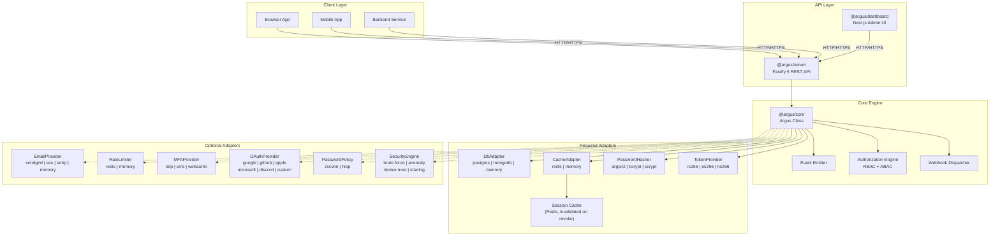

# Architecture

## System Overview

ArgusJS is organized as a Turborepo monorepo with 33 packages. At the center is `@argus/core`, a pure TypeScript authentication engine with zero framework dependencies. Everything else -- the HTTP server, dashboard, client SDK, and every adapter -- plugs into it through well-defined interfaces.



## Plugin Registry Pattern

ArgusJS uses a constructor-injection pattern rather than a service locator or runtime plugin registry. You pass concrete adapter instances to the `Argus` constructor, and the engine stores them as private fields. This design has several advantages:

1. **Type safety** -- the TypeScript compiler verifies that each adapter implements the required interface at build time.
2. **No magic** -- there is no global registry, no string-based lookup, no runtime reflection. You can see exactly which adapters are in use by reading the constructor call.
3. **Testability** -- in tests, you pass memory adapters. In production, you pass real adapters. The engine code does not change.

```typescript
// The Argus constructor signature:
class Argus {
  constructor(config: {
    // Required -- engine will not start without these
    db: DbAdapter;
    cache: CacheAdapter;
    hasher: PasswordHasher;
    token: TokenProvider;

    // Optional -- features degrade gracefully if absent
    email?: EmailProvider;
    rateLimiter?: RateLimiter;
    mfa?: Record<string, MFAProvider>;
    oauth?: Record<string, OAuthProviderAdapter>;
    passwordPolicy?: PasswordPolicy[];
    security?: SecurityEngine;

    // Configuration objects
    password?: { minLength?; maxLength?; historyCount? };
    session?: { maxPerUser?; absoluteTimeout?; inactivityTimeout?; rotateRefreshTokens?; cacheRefreshTokens?; refreshTokenCacheTTL? };
    lockout?: { maxAttempts?; duration?; captchaThreshold? };
    // ...
  });
}
```

## Authentication Pipelines

### Registration Pipeline

```
RegisterInput { email, password, displayName, ipAddress, userAgent }
    |
    v
1. Execute beforeRegister hook (if configured)
2. Normalize email (trim, lowercase)
3. Validate email format (regex)
4. Validate password length (minLength, maxLength)
5. Run password policies (zxcvbn score, HIBP breach check)
6. Check if email already exists in DB
7. Hash password (Argon2id / bcrypt / scrypt)
8. Create user record in DB (roles: ['user'], emailVerified: false)
9. Generate email verification token (32 random bytes)
10. Store hashed verification token in DB
11. Send verification email (if email provider configured)
12. Create session in DB
13. Sign JWT access token (15 min TTL)
14. Generate refresh token (48 random bytes), store hash + family in DB
15. Write audit log (USER_REGISTERED) -- buffered via async batching (flushed every 1s or 50 entries)
16. Emit 'user.registered' event
17. Execute afterRegister hook (if configured)
    |
    v
AuthResponse { user, accessToken, refreshToken, expiresIn, tokenType }
```

### Login Pipeline

```
LoginInput { email, password, ipAddress, userAgent, deviceFingerprint? }
    |
    v
1. Execute beforeLogin hook (if configured)
2. Normalize email
3. Find user by email in DB
4. Check if account is locked (lockedUntil > now)
5. Verify password against stored hash
    |-- FAIL: increment failedLoginAttempts
    |         if >= maxAttempts: lock account, emit 'user.locked'
    |         write audit LOGIN_FAILED, emit 'user.login_failed'
    |         throw INVALID_CREDENTIALS
    |
    v (password valid)
6. Reset failedLoginAttempts to 0
7. Check if MFA is enabled
    |-- YES: sign MFA challenge token (5 min TTL)
    |         return MFAChallengeResponse { mfaRequired, mfaToken, mfaMethods }
    |
    v (no MFA)
8. Create session in DB
9. Enforce session limit (create-then-trim for race safety)
10. Sign JWT access token
11. Generate + store refresh token
12. Update user lastLoginAt, lastLoginIp
13. Write audit LOGIN_SUCCESS
14. Emit 'user.login', 'session.created' events
15. Execute afterLogin hook
    |
    v
AuthResponse { user, accessToken, refreshToken, expiresIn, tokenType }
```

### Token Refresh Pipeline

Token rotation is configurable via `session.rotateRefreshTokens` (default: `true`). When rotation is disabled, steps 4, 7, 8, and 9 are skipped -- the same refresh token is reused until expiry. When `session.cacheRefreshTokens` is enabled, step 2 checks Redis first before falling back to PostgreSQL.

```
RefreshInput { refreshToken }
    |
    v
1. Hash the provided refresh token (SHA-256)
2. Look up token in DB by hash (or Redis cache if cacheRefreshTokens is enabled)
3. NOT FOUND -> throw INVALID_REFRESH_TOKEN
4. REVOKED -> TOKEN REUSE DETECTED (only when rotateRefreshTokens is true):
    a. Revoke entire token family
    b. Revoke all user sessions (security alert)
    c. Write audit TOKEN_REUSE_DETECTED
    d. Emit 'token.reuse_detected', 'security.suspicious_activity'
    e. Throw REFRESH_TOKEN_REUSE_DETECTED
5. EXPIRED -> throw INVALID_REFRESH_TOKEN
6. Verify session is not revoked
7. ATOMIC: revokeRefreshTokenIfActive(id, 'rotated') (skipped when rotation is off)
    |-- Returns false (another request already consumed it):
    |   Treat as token reuse (same as step 4)
    |
    v (token successfully consumed)
8. Generate new refresh token (same family, generation + 1) (skipped when rotation is off)
9. Store new token hash in DB (skipped when rotation is off)
10. Fetch user from DB (or user cache if available, 5-min TTL)
11. Sign new access token
12. Write audit TOKEN_REFRESHED (buffered via async batching)
13. Emit 'token.refreshed' event
    |
    v
AuthResponse { user, accessToken, refreshToken (new or same), expiresIn, tokenType }
```

### MFA Verification Pipeline

```
MFAVerifyInput { mfaToken, code, method }
    |
    v
1. Verify + decode MFA challenge token (JWT, 5 min TTL)
2. Extract userId from token
3. Fetch user from DB
4. Load encrypted MFA secret from DB
5. Decrypt MFA secret (AES-256-GCM)
6. Verify code against secret (TOTP / WebAuthn / SMS)
    |-- FAIL: write audit MFA_CHALLENGE_FAILED
    |         emit 'mfa.challenge_failed'
    |         throw INVALID_MFA_CODE
    |
    v (code valid)
7. Check if code is a backup code
    |-- YES: mark backup code as used
    |        emit 'mfa.backup_code_used'
    |
    v
8. Create session
9. Sign access token + generate refresh token
10. Write audit MFA_CHALLENGE_PASSED
11. Emit 'mfa.challenge_passed'
    |
    v
AuthResponse
```

### OAuth Pipeline

```
1. Client calls GET /v1/auth/oauth/:provider/authorize
   -> Generates authorization URL with state + PKCE
   -> Redirects user to provider

2. User authorizes at provider (Google, GitHub, etc.)
   -> Provider redirects back with code

3. Client calls POST /v1/auth/oauth/:provider/callback { code, state }
   -> Exchange code for tokens at provider
   -> Fetch user profile from provider
   -> Look up OAuthLink by (provider, providerUserId)
      |-- FOUND: login existing user
      |-- NOT FOUND:
      |   -> Look up user by email
      |      |-- FOUND + email verified at provider: link account
      |      |-- NOT FOUND: create new user (emailVerified: true)
   -> Create session, sign tokens
   -> Return AuthResponse
```

## Token Rotation and Reuse Detection

ArgusJS implements the OAuth 2.0 refresh token rotation pattern described in RFC 6749 with a critical improvement for TOCTOU (Time-of-Check-to-Time-of-Use) race conditions.

### How it works

1. Each refresh token belongs to a **family** (UUID). The first token in a family has `generation: 0`.
2. When a refresh token is used, it is **revoked** and a new token is created in the same family with `generation: N+1`.
3. If a **revoked** token is presented, this is a **reuse attack**: the entire family is revoked, and all user sessions are terminated.

### The TOCTOU Fix

A naive implementation has a race condition:

```
Thread A: check token -> not revoked -> revoke token -> issue new token
Thread B: check token -> not revoked -> revoke token -> issue new token  (RACE!)
```

Both threads see the token as active, both revoke it, both issue new tokens. Now there are two valid refresh tokens for the same family.

ArgusJS solves this with `revokeRefreshTokenIfActive()` -- an **atomic** operation that only succeeds for the first caller:

```sql
-- PostgreSQL implementation:
UPDATE refresh_tokens
SET revoked = true, revoked_at = NOW(), revoked_reason = $2
WHERE id = $1 AND revoked = false
RETURNING id;
-- Returns the id only if THIS call flipped revoked from false to true.
-- If another transaction already flipped it, returns nothing.
```

If the atomic revoke returns `false` (someone else already consumed the token), the second caller treats it as a reuse attack and revokes the entire family.

## Session Management

### Session Limits

ArgusJS enforces a maximum number of concurrent sessions per user (default: 5). The strategy is **create-then-trim**:

1. Create the new session first.
2. Count active sessions.
3. If over the limit, revoke the oldest sessions (FIFO).

This is race-safe: even under concurrent logins, each creates a session and then trims independently. The worst case is momentarily exceeding the limit by 1-2 sessions, which get cleaned up immediately.

### Session and User Caching

Sessions are cached in Redis on creation and invalidated when revoked (logout, security alert, session limit exceeded). This avoids a PostgreSQL round-trip for session validation on authenticated requests.

User records are also cached in Redis with a 5-minute TTL. The cache is invalidated whenever a user is updated (profile change, role change, password change, etc.), ensuring stale data does not persist.

### Session Fields

```typescript
interface Session {
  id: string;              // UUID
  userId: string;          // FK to users
  ipAddress: string;       // Client IP
  userAgent: string;       // Browser/device UA string
  deviceFingerprint: string | null;
  lastActivityAt: Date;    // Updated on token refresh
  expiresAt: Date;         // Absolute timeout
  revoked: boolean;
  revokedAt: Date | null;
  revokedReason: string | null;  // 'logout', 'session_limit_exceeded', 'security_alert', etc.
  createdAt: Date;
}
```

## Security Engine Components

The optional `@argus/security-engine` package provides four sub-components:

### 1. Brute Force Protection
Tracks failed login attempts per IP and per email using sliding windows in the cache. Triggers account lockout after configurable thresholds.

### 2. Anomaly Detector
Scores login risk based on:
- New device (not seen before for this user)
- New geolocation (IP-based)
- Unusual time of day
- Known Tor exit node

Risk score determines action: allow (< 50), challenge (50-75), block (> 75).

### 3. Sharing Detector
Monitors concurrent active IPs and devices per user. If a user is logged in from more IPs/devices than the threshold, it triggers an action: `allow`, `challenge`, or `block`.

### 4. Device Trust
Maintains a list of trusted devices per user. Trusted devices reduce the risk score from the anomaly detector. Users can view, trust, and remove devices from their profile.

## Event System

ArgusJS includes a built-in event emitter with wildcard support:

```typescript
// Exact match
argus.on('user.registered', (data) => { ... });

// Namespace wildcard
argus.on('security.*', (data) => { ... });

// Catch all
argus.on('*', (data) => { ... });
```

### Event Types

| Event | Emitted When |
|-------|-------------|
| `user.registered` | New user created |
| `user.login` | Successful login |
| `user.login_failed` | Failed login attempt |
| `user.logout` | User logged out |
| `user.locked` | Account locked due to failed attempts |
| `user.unlocked` | Account unlocked (by admin or timeout) |
| `user.deleted` | User soft-deleted |
| `user.email_verified` | Email verified |
| `user.password_changed` | Password changed |
| `user.password_reset_requested` | Password reset requested |
| `user.password_reset_completed` | Password reset completed |
| `session.created` | New session started |
| `session.revoked` | Session revoked |
| `session.expired` | Session expired |
| `token.refreshed` | Token refreshed |
| `token.reuse_detected` | Refresh token reuse attack detected |
| `mfa.enabled` | MFA enabled for user |
| `mfa.disabled` | MFA disabled |
| `mfa.challenge_passed` | MFA challenge completed |
| `mfa.challenge_failed` | MFA challenge failed |
| `mfa.backup_code_used` | Backup code used |
| `oauth.linked` | OAuth provider linked |
| `oauth.unlinked` | OAuth provider unlinked |
| `security.suspicious_activity` | Anomaly or attack detected |
| `security.brute_force_detected` | Brute force attempt detected |
| `admin.role_changed` | User role changed |
| `admin.permission_changed` | User permissions changed |
